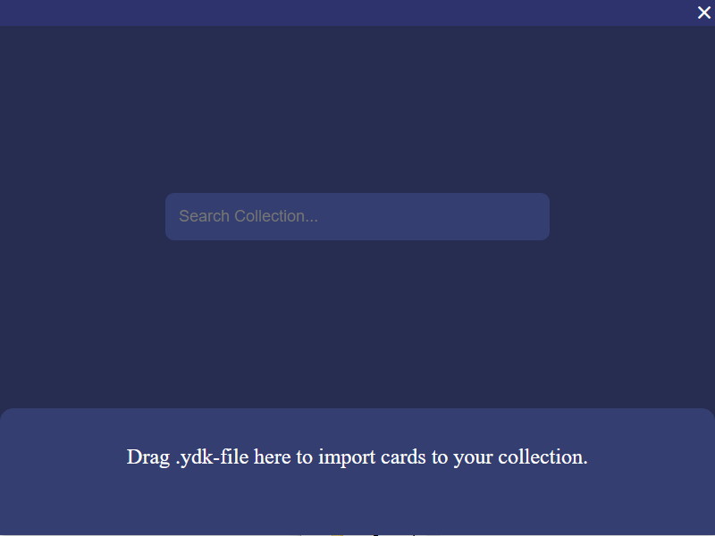
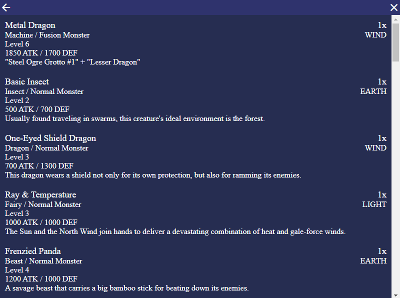

# YGOCardPoolTracker
A card pool tracker for the yugioh trading card game written in electron.

This program can read and import .ydk files. In these files a card gets represented by a single id which the program will use to look up information about the card via the [ygoprodeck API](https://db.ygoprodeck.com/api-guide/).

The intended use for this tracker is a format in which the card pool grows after every game/day/etc. This program provides a simple interface to search for a card and immediately know, whether or not its in your card pool. Everytime you get new cards you can import them into the database to keep track of your card pool in a simple and organized way. 
Additionally, since every card is only allowed up to three times in a deck, the program will automatically discard any additional copies of a card during the import process.

## Screenshots

